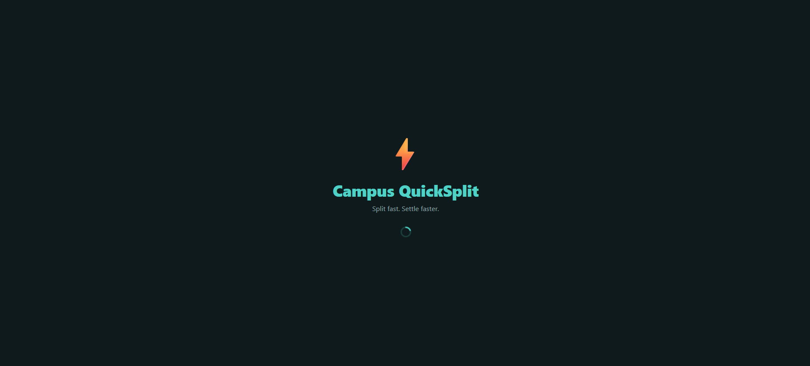
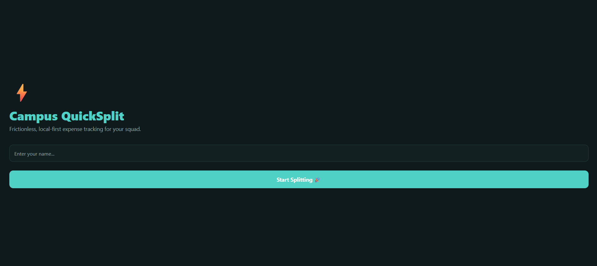
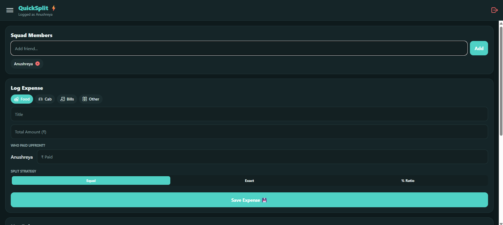
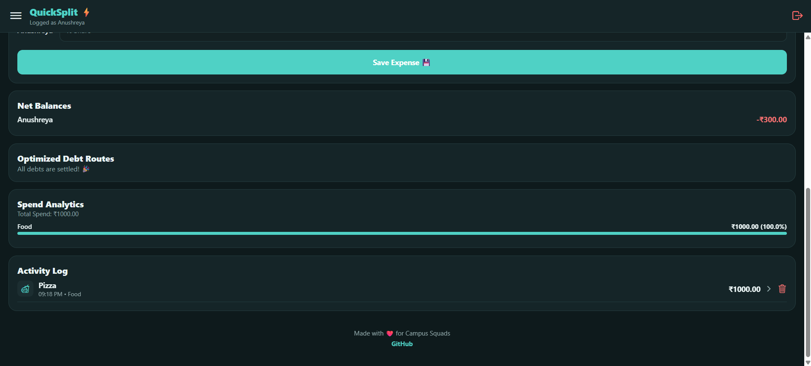
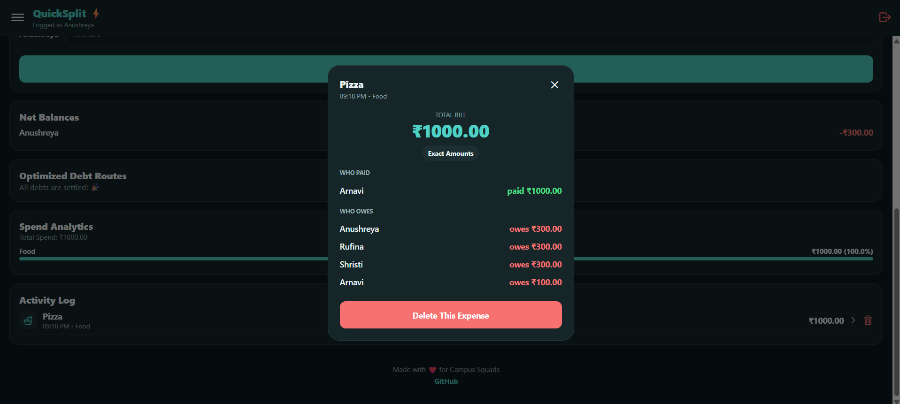
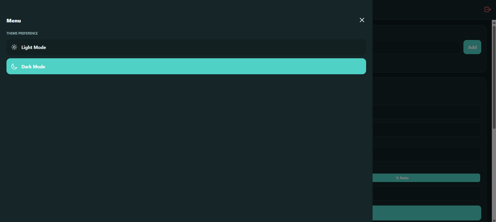
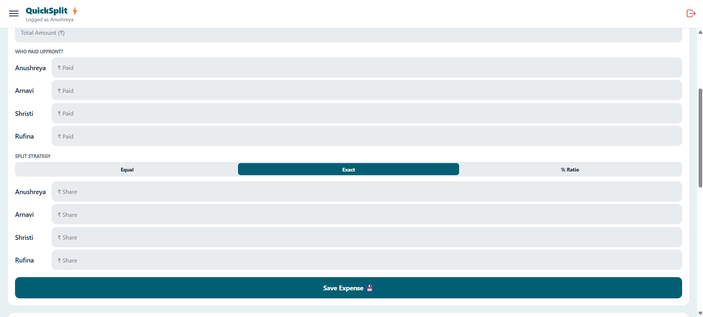

# ⚡ Campus QuickSplit
An interactive React Native app designed to track and settle shared group expenses on campus like auto rides, food bills, printouts, and split subscriptions, without any sign-up, phone verification, or cloud sync. Everything lives entirely on-device, and squads can log a bill and see who owes what in seconds.

## 📱 Screenshots

      

        

## 🚀 Features
* **Frictionless Local-First Design:** No accounts, no phone numbers, no network dependency, just enter a name and start splitting.
* **Three Splitting Modes:** Equal distribution with precise remainder handling, Exact manual amounts, and Percentage-based ratio splits.
* **Multi-Payer Support:** Any number of squad members can contribute upfront to a single bill, not just one payer per expense.
* **Settlement Optimization:** A debt-simplification algorithm collapses a tangled web of who-owes-who into the minimum set of direct peer-to-peer payments.
* **Split History Detail View:** Tap any transaction in the Activity Log to see exactly who paid what and who owes what, per expense.
* **Aggregated Balance Dashboard:** Live net balance per member, total spend, and category-wise spend breakdown.
* **Strict Input Validation:** Blocks empty fields, negative amounts, invalid group sizes, and mismatched payer/share sums before they ever get saved.
* **Calming Light & Dark Mode:** A cohesive teal-based theme in both modes, with the preference saved locally.

## 🛠️ Built With
* **Framework:** React Native (Expo)
* **State Management:** React Context API
* **Persistence:** AsyncStorage (on-device, fully offline)
* **Icons:** Expo Vector Icons (Ionicons)

## 📦 Installation & Setup
1. **Clone the repository:**
   ```bash
   git clone https://github.com/Anushreya-Satish/CampusQuickSplit.git
   cd CampusQuickSplit
   ```
2. **Install dependencies:**
   ```bash
   npm install
   ```

## 🎮 Usage
1. **Start the Expo dev server:**
   ```bash
   npx expo start
   ```
2. Scan the QR code with the **Expo Go** app on your phone, or press `w` to run it in a browser.

## 🧩 Project Structure
```
CampusQuickSplit/
├── App.js                       # All UI: splash, onboarding, dashboard, modals
├── src/
│   ├── context/
│   │   └── ExpenseContext.js    # Local-first state, AsyncStorage persistence
│   └── utils/
│       └── debtMinimizer.js     # Pure settlement-simplification algorithm
└── screenshots/
```
Business logic is kept separate from UI on purpose: `ExpenseContext.js` owns all state and storage, `debtMinimizer.js` is a pure function with no side effects, and `App.js` only renders and calls into the context.

## ✅ Requirements Coverage
Built for GDG App Dev Round 2. This submission targets **Phase 1** (the required tier for first-years); Phase 2 and 3 items below were built as bonus work, not fully completed.

## 📜 License
This project is open-source and available under the [MIT License](LICENSE). Feel free to fork, modify, and use it for your own project or learning needs!

---
<p align="center">
  🚀 <b>Built by a junior polyglot</b><br>
  <sub>Learning & Embarking on new Endeavours</sub>
</p>
